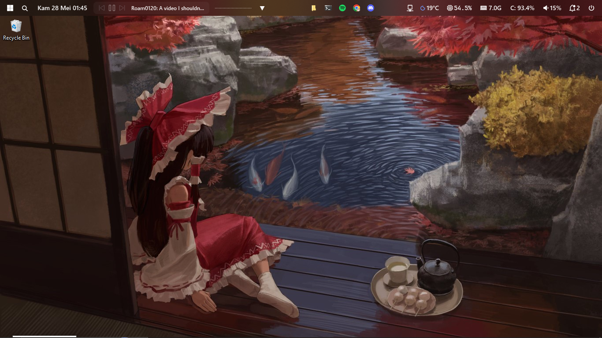
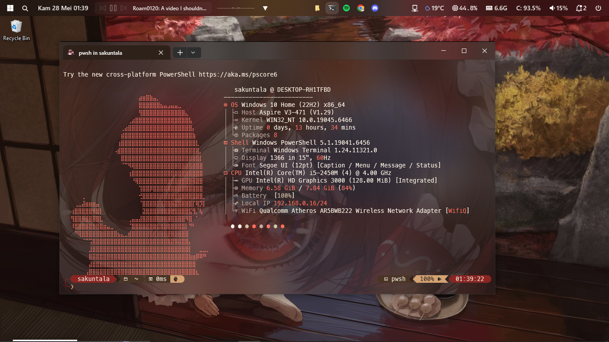
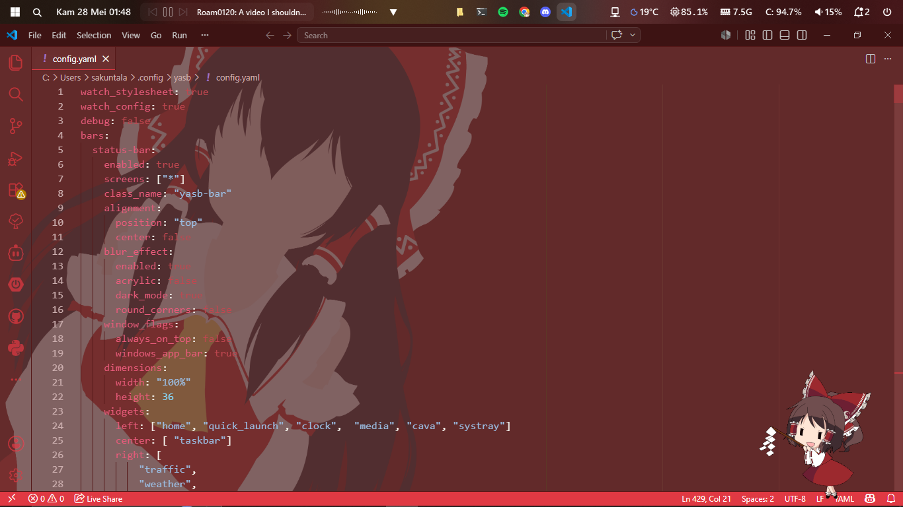
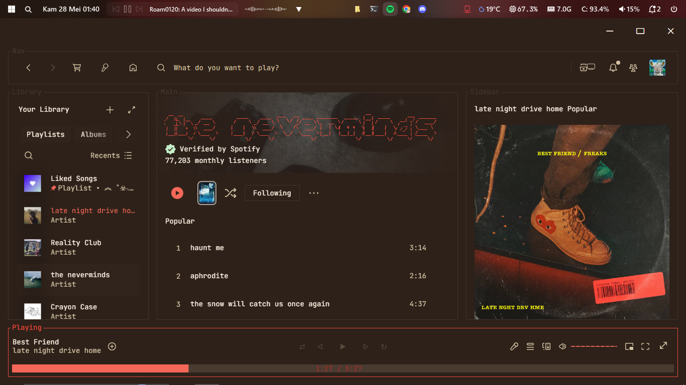
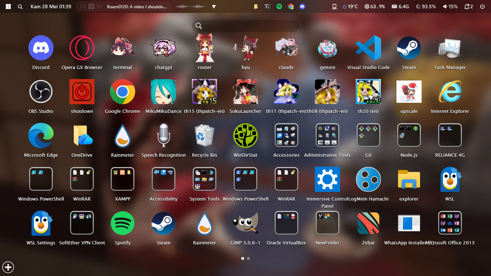
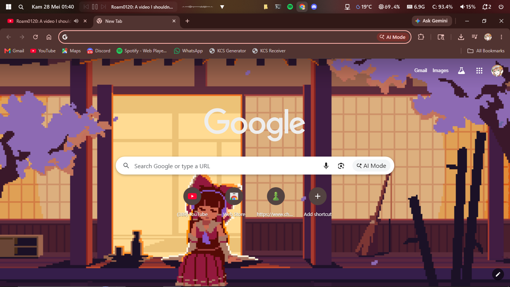
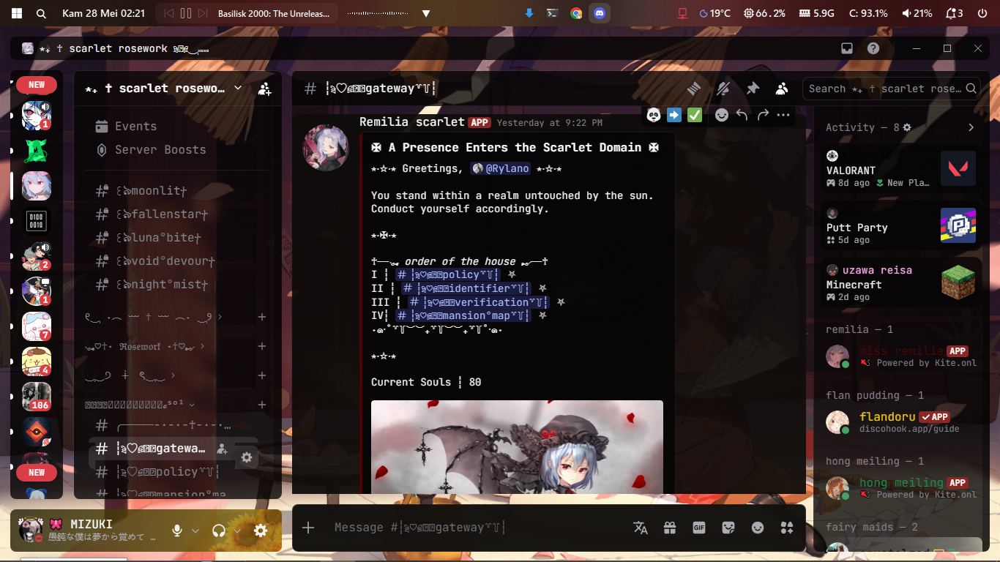
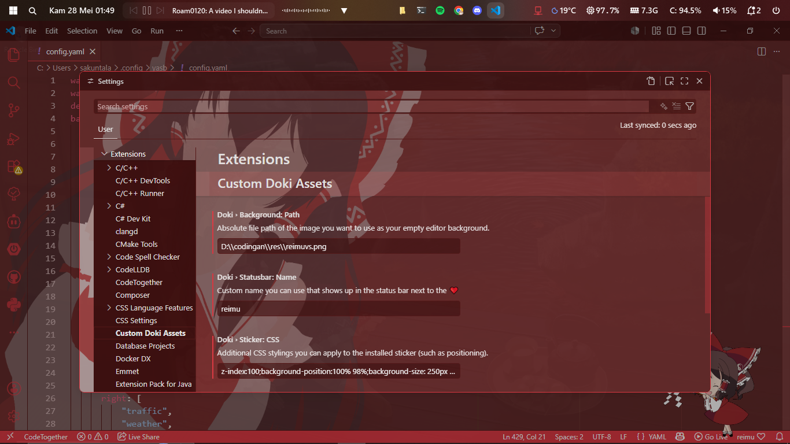
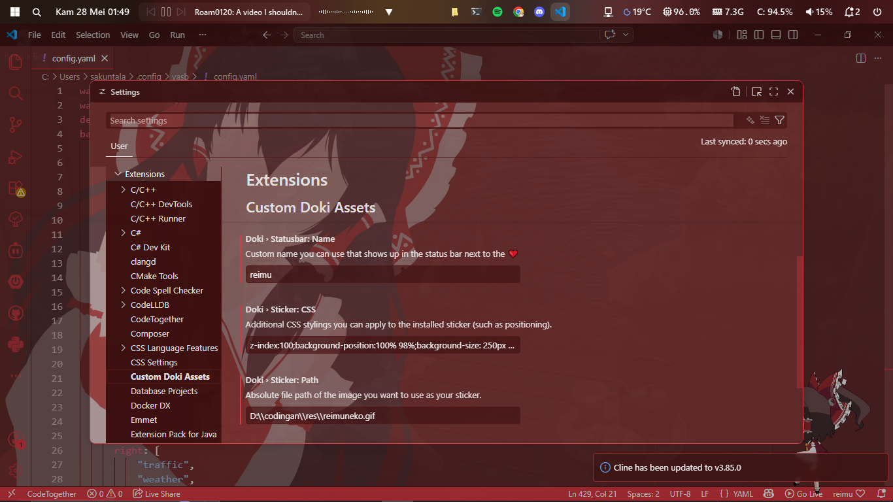

<div align="center">

# 🏮 window-rice

*a windows desktop rice inspired by the hakurei shrine*

**warm reds · shrine browns · soft pastels**

[](https://github.com/amnweb/yasb)
[](https://spicetify.app/)
[](https://vencord.dev/)
[](https://discord.gg/s6Yg7uyrjX)

</div>

---

## 🖼️ showcase

### desktop


### terminal


### vs code


### spicetify


### winlauncher


### browser


### discord


---

## 📁 contents

| folder | what's inside |
|---|---|
| `yasb/` | status bar config & stylesheet |
| `vscode/` | doki theme assets — background, sticker, previews |
| `terminal/` | powershell profile, fastfetch config, oh my posh themes, color schemes |
| `discord/` | vencord theme `reimuPastel.theme.css` |
| `spicetify/` | spicetify `text` theme + marketplace extension settings |
| `cursor/` | hakurei reimu pixel cursor set with installer |
| `browser/` | browser gif asset |
| `wallpaper/` | `reimu.jpg` |
| `showcase/` | preview screenshots |

---

## ✅ requirements

| tool | purpose |
|---|---|
| [YASB](https://github.com/amnweb/yasb) | windows status bar |
| [Cava](https://github.com/nicknisi/cava-windows) | audio visualizer widget |
| [WinLaunch](https://winlaunch.org/) | macos-style app launcher |
| [VS Code](https://code.visualstudio.com/) + [Doki Theme](https://marketplace.visualstudio.com/items?itemName=unthrottled.doki-theme) | editor + theme |
| [JetBrains Mono Nerd Font](https://www.nerdfonts.com/font-downloads) | font for terminal & bar |
| [Oh My Posh](https://ohmyposh.dev/) | powershell prompt |
| [Fastfetch](https://github.com/fastfetch-cli/fastfetch) | system info fetcher |
| [Vencord](https://vencord.dev/) | discord client mod |
| [Spicetify](https://spicetify.app/) | spotify client mod |
| [Windows Terminal](https://aka.ms/terminal) | terminal |

---

## 🪟 yasb — status bar

the top bar showing clock, media, taskbar, cpu/ram/disk, weather, volume, notifications, and a live cava visualizer.

**install**

```powershell
winget install AmN.yasb
```

or grab it from the [releases page](https://github.com/amnweb/yasb/releases).

**apply config**

```powershell
Copy-Item .\yasb\config.yaml $env:USERPROFILE\.config\yasb\config.yaml
Copy-Item .\yasb\styles.css  $env:USERPROFILE\.config\yasb\styles.css
```

restart yasb via the tray icon → **Restart**.

> ⚠️ the clock uses `id_ID` locale (indonesian). change `locale: "id_ID"` in `config.yaml` to your own if needed — e.g. `en_US`.

---

## 〰️ cava — audio visualizer

the mirrored bar animation inside yasb that reacts to system audio.

**install** — download the windows build from [cava-windows releases](https://github.com/nicknisi/cava-windows/releases) and put the `.exe` somewhere permanent.

cava is configured directly in `yasb/config.yaml` — no separate file needed:

```yaml
cava:
  bar_height: 10
  min_bar_height: 1
  bars_number: 28
  bar_width: 1
  bar_spacing: 2
  bar_type: "bars_mirrored"
  framerate: 60
  hide_empty: true
  gradient: 1
  gradient_color_1: '#ffffff'
  gradient_color_2: '#ffffff'
  gradient_color_3: '#ffffff'
```

> ⚠️ make sure `cava` is on your system `PATH`, or configure the executable path in yasb's settings.

---

## 🚀 winlaunch — app launcher

a standalone macos launchpad-style app launcher. separate from yasb.

**install** — download from [winlaunch.org](https://winlaunch.org/) and run the installer.

**setup**

1. launch winlaunch — it sits in the system tray
2. open it with the hotkey (default `F1`) to get the fullscreen overlay
3. drag and drop `.exe` shortcuts to add apps, or right-click → **Add App**
4. drag one app onto another to create folders
5. right-click the overlay → **Settings** to tweak size, blur, animations, and theme

> see `showcase/winlauncher.png` for reference — arrangement is up to you, no config to copy.

---

## 💻 vs code

**install doki theme**

1. open extensions `Ctrl+Shift+X`
2. search **Doki Theme** by unthrottled → install
3. `Ctrl+Shift+P` → `Preferences: Color Theme` → **Doki Theme: Rias Gremory**

**font**

install [JetBrainsMono NFP](https://www.nerdfonts.com/font-downloads) then add to `settings.json`:

```json
"editor.fontFamily": "JetBrainsMono NFP, JetBrains Mono, monospace",
"editor.fontSize": 14,
"editor.fontLigatures": true
```

**background & sticker**

configured through doki theme's **Custom Doki Assets** — no extra extensions needed.

1. open settings `Ctrl+,` → **Extensions** → **Custom Doki Assets**
2. set **Doki › Background: Path** → absolute path to `vscode/reimuvs.png`
3. set **Doki › Sticker: Path** → absolute path to `vscode/reimuneko.gif`
4. set **Doki › Sticker: CSS**:
   ```
   z-index:100;background-position:100% 98%;background-size: 250px
   ```
5. set **Doki › Statusbar: Name** → `reimu`
6. `Ctrl+Shift+P` → **Doki: Install Assets** → reload when prompted




---

## 🖥️ terminal

windows terminal + powershell with fastfetch on startup, oh my posh prompt, and modern cli tools.

**1. install tools**

```powershell
winget install JanDeDobbeleer.OhMyPosh
winget install ajeetdsouza.zoxide
winget install eza-community.eza
winget install sharkdp.bat
winget install fastfetch-cli.fastfetch
```

**2. font**

install [JetBrainsMono NFP](https://www.nerdfonts.com/font-downloads) then set it in windows terminal `settings.json`:

```json
"font": {
  "face": "JetBrainsMono NFP",
  "size": 12
}
```

**3. color schemes**

open windows terminal settings → open JSON file → paste the contents of `terminal/color scheme.txt` into the `"schemes"` array.

| scheme | vibe |
|---|---|
| **Hakurei Autumn** | warm dark browns, muted reds |
| **Hakurei Reimu** | deep purple-blue, red & gold |
| **Reimu Hakurei** | dark violet, crimson red |
| **Reimu Warm Autumn** | rich warm browns, off-white text |
| **Rosé Pine** | muted rose, lavender |
| **Soft Pink Rice** | catppuccin-based soft pinks |

set your scheme in the powershell profile entry:

```json
"colorScheme": "Reimu Warm Autumn"
```

**4. powershell profile & fastfetch**

```powershell
Copy-Item .\terminal\omposh_themes\ $env:USERPROFILE\omposh_themes\ -Recurse
Copy-Item .\terminal\fastfetch\ $env:USERPROFILE\.config\fastfetch\ -Recurse
Copy-Item .\terminal\startup.ps1 $PROFILE
```

> ⚠️ edit `startup.ps1` before copying — update these hardcoded paths to match your setup:

```powershell
& "D:\codingan\fastfetch.exe"                         # → your fastfetch.exe path
$env:POSH_THEMES_PATH = "D:\codingan\omposh_themes\"  # → your themes folder
```

also update the reimu logo path in `terminal/fastfetch/config.jsonc`:

```json
"source": "C:/Users/Sakuntala/.config/fastfetch/reimu.txt"
// change "Sakuntala" to your windows username
```

**5. reload**

```powershell
. $PROFILE
```

---

## 🖱️ cursor

hakurei reimu pixel cursor set, included in `cursor/Hakurei Reimus Pixel Cursors ani/`.

1. open the `cursor/Hakurei Reimus Pixel Cursors ani/` folder
2. right-click `install.inf` → **Install**
3. windows settings → bluetooth & devices → mouse → additional mouse settings → **Pointers** tab
4. under **Scheme** select **Hakurei Reimus Pixel Cursors**
5. click **Apply**

---

## 🎮 discord — vencord

**install vencord** — follow the [vencord install guide](https://vencord.dev/install/).

**apply theme**

1. discord → user settings → **Vencord → Themes → Local Themes** → open folder
2. copy `discord/reimuPastel.theme.css` into the folder
3. back in vencord settings, enable **ReimuWarmPlus**

built on [DiscordPlus](https://github.com/plusinsta/discord-plus) with a warm shrine-brown palette and JetBrains Mono.

---

## 🎵 spicetify — spotify

**install**

```powershell
iwr -useb https://raw.githubusercontent.com/spicetify/cli/main/install.ps1 | iex
iwr -useb https://raw.githubusercontent.com/spicetify/marketplace/main/resources/install.ps1 | iex
```

**apply theme**

```powershell
$themePath = "$env:USERPROFILE\AppData\Local\spicetify\Themes\text"
New-Item -ItemType Directory -Force -Path $themePath
Copy-Item .\spicetify\text\color.ini $themePath\color.ini
Copy-Item .\spicetify\text\user.css  $themePath\user.css

spicetify config current_theme text color_scheme Spicetify
spicetify apply
```

**marketplace extensions**

go to **Marketplace → Settings → Import** and load `spicetify/marketplace-settings-2026-05-26T15_06_26.763Z.json`.

| extension | purpose |
|---|---|
| adblockify | blocks spotify ads |
| Custom Controls | replaces the titlebar |
| No Controls | removes the titlebar (`F8` to toggle) |
| Full Screen | fancy album art fullscreen view |

---

## 🖼️ wallpaper

right-click `wallpaper/reimu.jpg` → **Set as desktop background**,
or windows settings → personalization → background.

---

## 🗂️ checklist

- [ ] yasb installed, config & styles copied to `~/.config/yasb/`
- [ ] cava installed and on `PATH`
- [ ] winlaunch installed and apps arranged
- [ ] jetbrains mono nerd font installed
- [ ] vs code doki theme installed, color theme set to **rias gremory**
- [ ] doki custom assets configured (background + sticker paths set, assets installed)
- [ ] windows terminal color scheme added and selected
- [ ] `startup.ps1` paths updated and copied to `$PROFILE`
- [ ] fastfetch config username updated
- [ ] oh my posh themes copied
- [ ] cursor scheme installed via `install.inf`
- [ ] vencord installed, `reimuPastel.theme.css` enabled
- [ ] spicetify `text` theme applied, marketplace extensions imported
- [ ] wallpaper set

---

<div align="center">

*made with love for gensokyo*

[](https://discord.gg/s6Yg7uyrjX)

</div>
